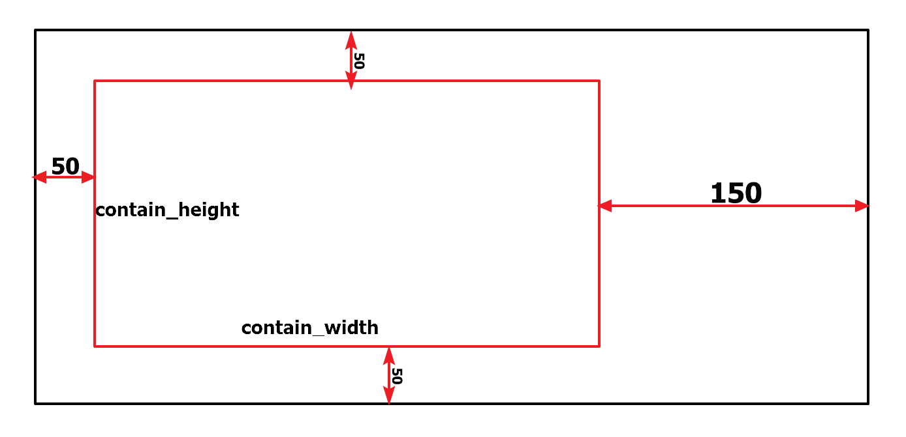

使用zrender画椭圆
-----
整体的思路是根据他们给的公式，算出椭圆上面的点的xy坐标，然后画点。

### 1.项目说明
首先来看个图

主要是使用zrender来封装色容差图（SDCM）

### 2.需求说明
- 坐标根据所有图形输入的xy的最大最小进行设定，并且xy轴的比例要一致
- 可以随时往里面添加和删除图形
- 可以将用户输入的坐标在图上进行展示，超出可视范围要将其放在对应的边框线上。
- 右侧要显示相应的系列的名字
### 3.目录说明
zrender-2.1.0--->test---->1-11都是（数字越大，版本越高）

### 4.相关公式

### 5.代码说明
#### 坐标系说明


#### 构造函数myEllipse说明
- 第一个参数：给定的容器ID值，图像就是在这里面画的
- 第二个参数：给定的数据，可以为null
- 第三个参数：是否显示坐标轴的脚标

#### 函数数据结构说明
```javascript
arrDataAll=[{
    "type":"Ellipse",
    "dataId":"Ellipse1",
    "data":{
            "g11":39,
            "g12":-19.5,
            "g22":27.5,
            "x0":0.44,
            "y0":0.403,
            "r1":5,
            "r2":6,
        },
    "name":"C78.376_3000K"
},{
    "type":"polygon",
    "dataId":"polygon1",
    "data":[[0.48106,0.43149],[0.45614,0.42586],[0.43725,0.38922],[0.45906,0.39406]],
    "name":"C78.377_2700K"  
}]
```
- 传进来的是一个数组，数组里面是对象，每个对象对应一个图形

- 每个对象里面的
    - type:说明图像的类型，是椭圆还是多边形
    - dataId:每个图像唯一的身份标识，主要用来新增和删除对应的图形
    - data:核心，用来画图形的主要数据
    - name:每个不同的data都是一个单独的系列，每个系列都有一个名称，name就是名称
### 更新说明
#### 11.html
1. 只是新增了部分数据，做个记录
#### 12.html
1. 去除最外层的边框线
2. 内部分割线采用虚线（项目中用zrender3.0版本，在10中未修改）
3. 支持不显示坐标
4. 支持初始化数组为空时，图形坐标的正确显示（默认色坐标为0,0），其实就是没有数据的时候，让坐标为0-1
5. 1个椭圆标准的时候，支持配置显示sdcm和标题

