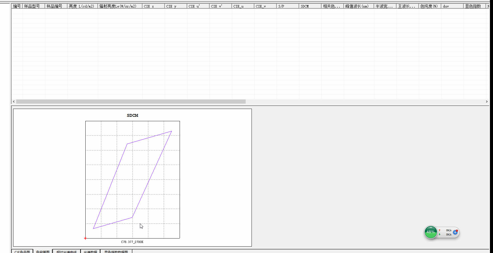

使用zrender画椭圆
-----
整体的思路是根据他们给的公式，算出椭圆上面的点的xy坐标，然后画点。

### 1.项目说明
首先来看个图

主要是使用zrender来封装色容差图（SDCM）

### 2.需求说明
- 坐标根据所有图形输入的xy的最大最小进行设定，并且xy轴的比例要一致
- 可以随时往里面添加和删除图形
- 可以将用户输入的坐标在图上进行展示，超出可视范围要将其放在对应的边框线上。
- 右侧要显示相应的系列的名字
### 3.目录说明
zrender-2.1.0--->test---->1-11都是（数字越大，版本越高）

### 4.相关公式

### 5.更新说明
#### 11.html
1. 只是新增了部分数据，做个记录
#### 12.html
1. 去除最外层的边框线
2. 内部分割线采用虚线（项目中用zrender3.0版本，在10中未修改）
3. 支持不显示坐标
4. 支持初始化数组为空时，图形坐标的正确显示（默认色坐标为0,0），其实就是没有数据的时候，让坐标为0-1
5. 1个椭圆标准的时候，支持配置显示sdcm和标题

